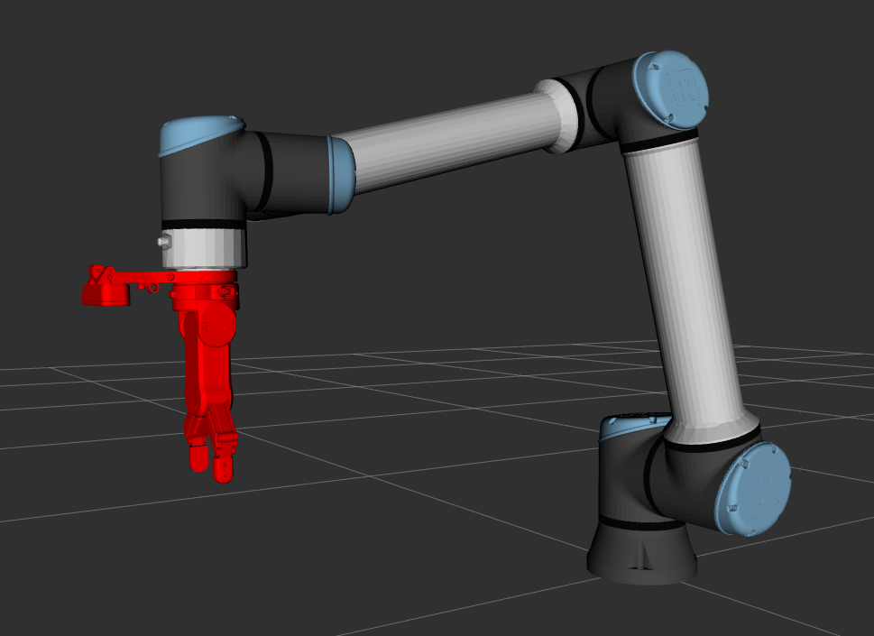

# Vision-based fruit havesting

**Author**: David Nie  
**Supervisor**: Dr. Leo Wu

**Robot**: UR10e  
**End-effector setup**: OnRobot RG2 V2 + Quick Changer (QC)  
**Depth Camera**: OnRobot Eye System (Intel Realsense 415 Depth Camera)  
**Dev Env**: `Ubuntu 22.04`  
**Dev tools**: `MoveIt!`, `ROS2 Humble`, `YOLOv11`, `hand-eye calibration`  

## Table of Contents
- [Vision-based fruit havesting](#vision-based-fruit-havesting)
	- [Table of Contents](#table-of-contents)
		- [TO-DO list](#to-do-list)
		- [Workspace setup](#workspace-setup)
	- [Demo videos](#demo-videos)
		- [Vision-based pick and place at varying heights on a horizontal surface](#vision-based-pick-and-place-at-varying-heights-on-a-horizontal-surface)
		- [Vision-based fruit harvesting](#vision-based-fruit-harvesting)
	- [How to run the demos](#how-to-run-the-demos)
		- [Horizontal Pick \& Place](#horizontal-pick--place)
		- [Vertical Fruit Harvesting](#vertical-fruit-harvesting)
	- [Depth Camera Visualisation](#depth-camera-visualisation)
	- [YOLO-based object detection + transformation using the depth camera](#yolo-based-object-detection--transformation-using-the-depth-camera)
	- [How to test Gripper](#how-to-test-gripper)
		- [End-effector Visualisation](#end-effector-visualisation)

### TO-DO list 
* Improve fruit harvesting cycle time by trying out different planners
  * RRT*
  * CForest which supports multi-threading
* Design custom gripper to improve gripping efficiency/accuracy

### Workspace setup
* Camera
* custom_interface
  * contains ROS2 `.srv` and `.msg`
* demo_package
* end_effector_description
* gripper
* moveit_path_planner
  * define services that move the arm
* ur10e_moveit_config
  * created using `moveit_setup_assistant`
  * uses RRTConnect planner
* ur10e_moveit_config_official
  * cloned from `UR_ROS2_DRIVER` package developed by Universal Robotics
  * uses TRRT planner by default
    * the planner can be changed via `ompl_planning.yaml` file

## Demo videos

### Vision-based pick and place at varying heights on a horizontal surface

**Planner**: RRTConnect from ompl  
**Cycle Time**: 17-20s  
**Video Link**: https://youtu.be/pAT8Y0UHFJc  

### Vision-based fruit harvesting

**Planner**: TRRT from ompl  
**Cycle Time**: ~75s  
**Video Link**: https://youtu.be/1r7PfkH8pU8  

## How to run the demos

### Horizontal Pick & Place
* Switch to `origin/david_hor_variousHeight_backup` branch
* Build and source the workspace
* In one terminal, run `ros2 launch end_effector_description display.launch.py`
* In another terminal, run `ros2 run demo_package horizontal_fruit_gripping_demo`

### Vertical Fruit Harvesting
* Switch to `main` branch
* Build and source the workspace
* In one terminal, run `ros2 launch end_effector_description display.launch.py`
* In another terminal, run `ros2 run demo_package vertical_fruit_gripping_demo.py`

## Depth Camera Visualisation

## YOLO-based object detection + transformation using the depth camera

## How to test Gripper

1. First, connect the Ethernet Cable from Web Client port of the Eye Box 
2. Then, go to 192.168.1.1 to make sure you are logged in with username: `admin` and password: `OnRobot1`
3. Now, go to Devices -> RG2 and manually move the `width` bar around, see if it works
4. Finally, test it in a terminal, `curl "http://192.168.1.1/api/dc/rgxp2/set_width/0/{width}/{force}"`; width=[0,100], force=[3,40]

e.g. 
	Grip: `curl "http://192.168.1.1/api/dc/rgxp2/set_width/0/0/40"`
	Release: `curl "http://192.168.1.1/api/dc/rgxp2/set_width/0/100/40"`

If that worked, we are now ready to launch the gripper package

In one terminal: `ros2 run gripper gripper_server`
In another terminal: `ros2 run gripper gripper_client`

### End-effector Visualisation

