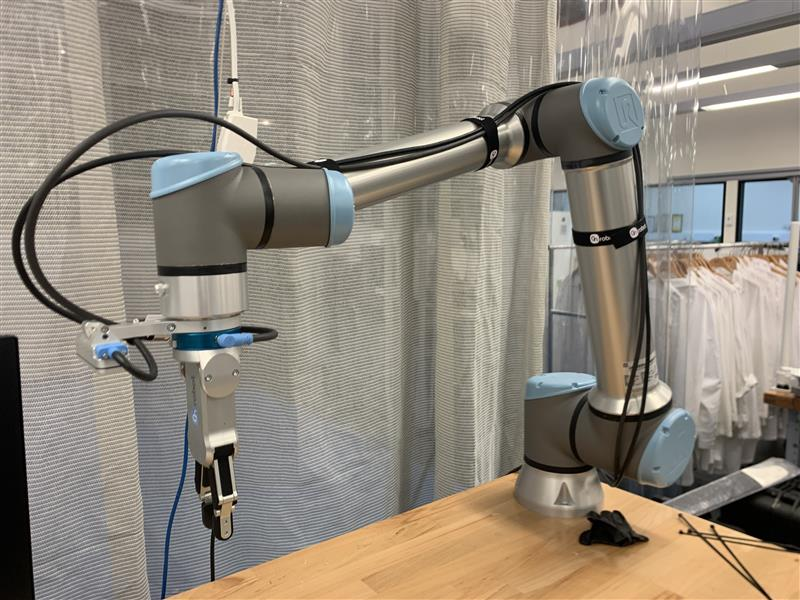
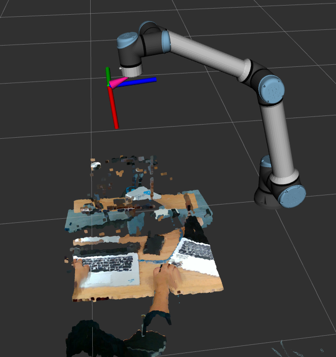
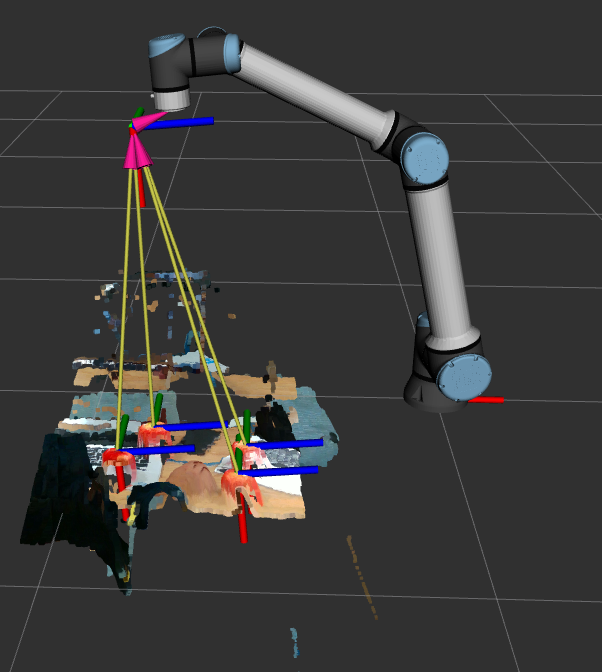
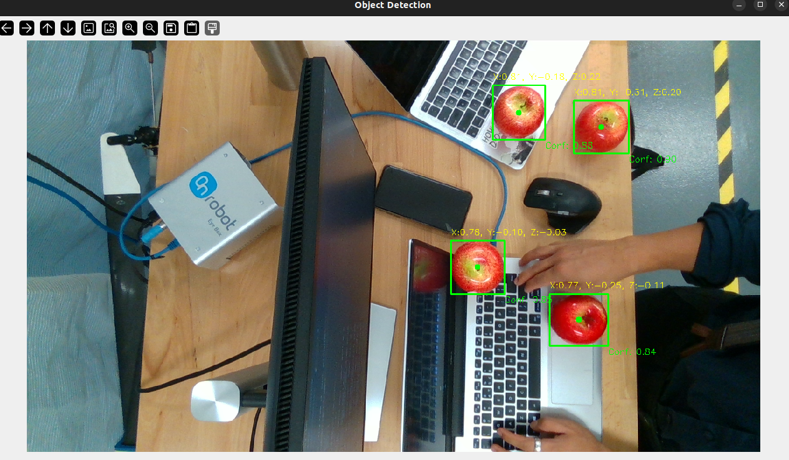

# This is a temporary solution while MoMa is being fixed

### Robot: UR10e
### Gripper: OnRobot RG2 V2 + Quick Changer (QC)
### Depth Camera: OnRobot Eye

## Depth Camera Visualisation

## YOLO-based object detection + transformation using the depth camera

## How to test Gripper

1. First, connect the Ethernet Cable from Web Client port of the Eye Box 
2. Then, go to 192.168.1.1 to make sure you are logged in with username: `admin` and password: `OnRobot1`
3. Now, go to Devices -> RG2 and manually move the `width` bar around, see if it works
4. Finally, test it in a terminal, `curl "http://192.168.1.1/api/dc/rgxp2/set_width/0/{width}/{force}"`; width=[0,100], force=[3,40]

e.g. 
	Grip: `curl "http://192.168.1.1/api/dc/rgxp2/set_width/0/0/40"`
	Release: `curl "http://192.168.1.1/api/dc/rgxp2/set_width/0/100/40"`

If that worked, we are now ready to launch the gripper package

In one terminal: `ros2 run gripper gripper_server`
In another terminal: `ros2 run gripper gripper_client`
